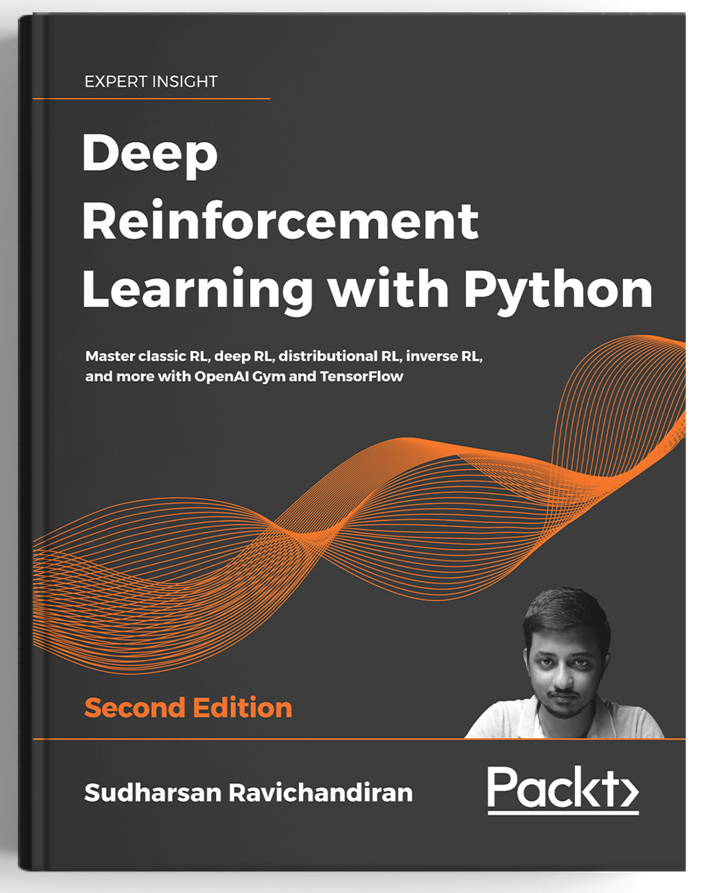

# [Deep Reinforcement Learning With Python](https://www.amazon.com/gp/product/B08HSHV72N/ref=dbs_a_def_rwt_bibl_vppi_i4)

###  Master classic RL, deep RL, distributional RL, inverse RL, and more using OpenAI Gym and TensorFlow with extensive Math 

## About the book
With significant enhancement in the quality and quantity of algorithms in recent
years, this second edition of Hands-On Reinforcement Learning with Python has been completely 
revamped into an example-rich guide to learning state-of-the-art reinforcement
learning (RL) and deep RL algorithms with TensorFlow and the OpenAI Gym
toolkit.

In addition to exploring RL basics and foundational concepts such as the Bellman
equation, Markov decision processes, and dynamic programming, this second
edition dives deep into the full spectrum of value-based, policy-based, and actor-
critic RL methods with detailed math. It explores state-of-the-art algorithms such as DQN, TRPO, PPO
and ACKTR, DDPG, TD3, and SAC in depth, demystifying the underlying math and
demonstrating implementations through simple code examples.

The book has several new chapters dedicated to new RL techniques including
distributional RL, imitation learning, inverse RL, and meta RL. You will learn
to leverage Stable Baselines, an improvement of OpenAI's baseline library, to
implement popular RL algorithms effortlessly. The book concludes with an overview
of promising approaches such as meta-learning and imagination augmented agents
in research.

# Table of Contents
Download the detailed and complete table of contents from [here.](table%20of%20contents/Deep%20Reinforcement%20Learning%20With%20Python%20by%20Sudharsan%20Ravichandiran%20toc.pdf)

## [1. Fundamentals of Reinforcement Learning](01.%20Fundamentals%20of%20Reinforcement%20Learning)

* 1.1. [Key Elements of Reinforcement Learning](01.%20Fundamentals%20of%20Reinforcement%20Learning/1.01.%20Key%20Elements%20of%20Reinforcement%20Learning%20.ipynb)
* 1.2. Basic Idea of Reinforcement Learning
* 1.3. Reinforcement Learning Algorithm
* 1.4. RL Agent in the Grid World
* 1.5. How RL differs from other ML paradigms?
* 1.6. Markov Decision Processes
* 1.7. Action Space, Policy, Episode and Horizon
* 1.8. Return, Discount Factor and Math Essentials 
* 1.9. Value Function and Q Function
* 1.10. Model-Based and Model-Free Learning
* 1.11. Different Types of Environments
* 1.12. Applications of Reinforcement Learning
* 1.13. Reinforcement Learning Glossary

### [2. A Guide to the Gym Toolkit](02.%20A%20Guide%20to%20the%20Gym%20Toolkit)
* 2.1. Setting Up our Machine
* [2.2. Creating our First Gym Environment](02.%20A%20Guide%20to%20the%20Gym%20Toolkit/2.02.%20%20Creating%20our%20First%20Gym%20Environment.ipynb)
* 2.3. Generating an episode
* [2.4. Classic Control Environments](02.%20A%20Guide%20to%20the%20Gym%20Toolkit/2.04.%20Classic%20Control%20Environments.ipynb)
* [2.5. Cart Pole Balancing with Random Policy](02.%20A%20Guide%20to%20the%20Gym%20Toolkit/2.05.%20Cart%20Pole%20Balancing%20with%20Random%20Policy.ipynb)
* 2.6. Atari Game Environments
* 2.7. Agent Playing the Tennis Game
* 2.8. Recording the Game
* 2.9. Other environments
* 2.10. Environment Synopsis

### [3. Bellman Equation and Dynamic Programming](03.%20Bellman%20Equation%20and%20Dynamic%20Programming)
* [3.1. The Bellman Equation](03.%20Bellman%20Equation%20and%20Dynamic%20Programming/3.01.%20The%20Bellman%20Equation.ipynb)
* 3.2. Bellman Optimality Equation
* 3.3. Relation Between Value and Q Function
* 3.4. Dynamic Programming
* 3.5. Value Iteration
* [3.6. Solving the Frozen Lake Problem with Value Iteration](03.%20Bellman%20Equation%20and%20Dynamic%20Programming/3.06.%20Solving%20the%20Frozen%20Lake%20Problem%20with%20Value%20Iteration.ipynb)
* 3.7. Policy iteration
* [3.8. Solving the Frozen Lake Problem with Policy Iteration](03.%20Bellman%20Equation%20and%20Dynamic%20Programming/3.08.%20Solving%20the%20Frozen%20Lake%20Problem%20with%20Policy%20Iteration.ipynb)
* 3.9. Is DP Applicable to all Environments?

### [4. Monte Carlo Methods](04.%20Monte%20Carlo%20Methods)
* [4.1. Understanding the Monte Carlo Method](04.%20Monte%20Carlo%20Methods/4.01.%20Understanding%20the%20Monte%20Carlo%20Method.ipynb)
* [4.2. Prediction and Control Tasks](04.%20Monte%20Carlo%20Methods/4.02.%20%20Prediction%20and%20control%20tasks.ipynb)
* 4.3. Monte Carlo Prediction
* 4.4. Understanding the BlackJack Game
* [4.5. Every-visit MC Prediction with Blackjack Game](04.%20Monte%20Carlo%20Methods/4.05.%20Every-visit%20MC%20Prediction%20with%20Blackjack%20Game.ipynb)
* [4.6. First-visit MC Prediction with Blackjack Game](04.%20Monte%20Carlo%20Methods/4.06.%20First-visit%20MC%20Prediction%20with%20Blackjack%20Game.ipynb)
* 4.7. Incremental Mean Updates
* 4.8. MC Prediction (Q Function)
* 4.9. Monte Carlo Control
* 4.10. On-Policy Monte Carlo Control
* 4.11. Monte Carlo Exploring Starts
* 4.12. Monte Carlo with Epsilon-Greedy Policy
* [4.13. Implementing On-Policy MC Control](04.%20Monte%20Carlo%20Methods/4.13.%20Implementing%20On-Policy%20MC%20Control.ipynb)
* 4.14. Off-Policy Monte Carlo Control
* 4.15. Is MC Method Applicable to all Tasks?

### [5. Understanding Temporal Difference Learning](05.%20Understanding%20Temporal%20Difference%20Learning)
* [5.1. TD Learning](05.%20Understanding%20Temporal%20Difference%20Learning/5.01.%20TD%20Learning.ipynb)
* 5.2. TD Prediction
* [5.3. Predicting the Value of States in a Frozen Lake Environment](05.%20Understanding%20Temporal%20Difference%20Learning/5.03.%20Predicting%20the%20Value%20of%20States%20in%20a%20Frozen%20Lake%20Environment.ipynb)
* 5.4. TD Control
* 5.5. On-Policy TD Control - SARSA
* [5.6. Computing Optimal Policy using SARSA](05.%20Understanding%20Temporal%20Difference%20Learning/5.06.%20Computing%20Optimal%20Policy%20using%20SARSA.ipynb)
* 5.7. Off-Policy TD Control - Q Learning
* [5.8. Computing the Optimal Policy using Q Learning](05.%20Understanding%20Temporal%20Difference%20Learning/5.08.%20Computing%20the%20Optimal%20Policy%20using%20Q%20Learning.ipynb)
* 5.9. The Difference Between Q Learning and SARSA
* 5.10. Comparing DP, MC, and TD Methods

### [6. Case Study: The MAB Problem](06.%20Case%20Study:%20The%20MAB%20Problem)
* 6.1. The MAB Problem
* 6.2. Creating Bandit in the Gym
* [6.3. Epsilon-Greedy](06.%20Case%20Study:%20The%20MAB%20Problem/6.03.%20Epsilon-Greedy.ipynb)
* [6.4. Implementing Epsilon-Greedy](06.%20Case%20Study:%20The%20MAB%20Problem/6.04.%20Implementing%20epsilon-greedy%20.ipynb)
* 6.5. Softmax Exploration
* [6.6. Implementing Softmax Exploration](06.%20Case%20Study:%20The%20MAB%20Problem/6.06.%20Implementing%20Softmax%20Exploration.ipynb)
* 6.7. Upper Confidence Bound
* [6.8. Implementing UCB](06.%20Case%20Study:%20The%20MAB%20Problem/6.08.%20Implementing%20UCB.ipynb)
* 6.9. Thompson Sampling
* [6.10. Implementing Thompson Sampling](6.%20Case%20Study:%20The%20MAB%20Problem/6.10.%20Implementing%20Thompson%20Sampling.ipynb)
* 6.11. Applications of MAB
* [6.12. Finding the Best Advertisement Banner using Bandits](06.%20Case%20Study:%20The%20MAB%20Problem/6.12.%20Finding%20the%20Best%20Advertisement%20Banner%20using%20Bandits.ipynb)
* 6.13. Contextual Bandits

### [7. Deep Learning Foundations](07.%20Deep%20learning%20foundations)

* 7.1. Biological and artifical neurons
* 7.2. ANN and its layers 
* 7.3. Exploring activation functions 
* 7.4. Forward and backward propgation in ANN
* [7.5. Building neural network from scratch](07.%20Deep%20learning%20foundations/7.05%20Building%20Neural%20Network%20from%20scratch.ipynb)
* 7.6. Recurrent neural networks 
* 7.7. LSTM-RNN
* 7.8. Convolutional neural networks
* 7.9. Generative adversarial networks 

### [8. Getting to Know TensorFlow](08.%20A%20primer%20on%20TensorFlow)

* 8.1. What is TensorFlow?
* 8.2. Understanding Computational Graphs and Sessions
* 8.3. Variables, Constants, and Placeholders
* 8.4. Introducing TensorBoard
* [8.5. Handwritten digits classification using Tensorflow](08.%20A%20primer%20on%20TensorFlow/8.05%20Handwritten%20digits%20classification%20using%20TensorFlow.ipynb)
* 8.6. Visualizing Computational graph in TensorBord
* 8.7. Introducing Eager execution
* [8.8. Math operations in TensorFlow](08.%20A%20primer%20on%20TensorFlow/8.08%20Math%20operations%20in%20TensorFlow.ipynb)
* 8.9. Tensorflow 2.0 and Keras
* [8.10. MNIST digits classification in Tensorflow 2.0](08.%20A%20primer%20on%20TensorFlow/8.10%20MNIST%20digits%20classification%20in%20TensorFlow%202.0.ipynb)

### [9. Deep Q Network and its Variants](09.%20%20Deep%20Q%20Network%20and%20its%20Variants)

* [9.1. What is Deep Q Network?](09.%20%20Deep%20Q%20Network%20and%20its%20Variants/9.01.%20What%20is%20Deep%20Q%20Network%3F.ipynb)
* 9.2. Understanding DQN
* [9.3. Playing Atari Games using DQN](09.%20%20Deep%20Q%20Network%20and%20its%20Variants/9.03.%20Playing%20Atari%20Games%20using%20DQN.ipynb)
* 9.4. Double DQN
* 9.5. DQN with Prioritized Experience Replay
* 9.6. Dueling DQN
* 9.7. Deep Recurrent Q Network

### [10. Policy Gradient Method](10.%20Policy%20Gradient%20Method)
* [10.1. Why Policy Based Methods?](10.%20Policy%20Gradient%20Method/10.01.%20Why%20Policy%20based%20Methods.ipynb)
* [10.2. Policy Gradient Intuition](10.%20Policy%20Gradient%20Method/10.02.%20Policy%20Gradient%20Intuition.ipynb)
* 10.3. Understanding the Policy Gradient
* 10.4. Deriving Policy Gradien
* 10.5. Variance Reduction Methods
* 10.6. Policy Gradient with Reward-to-go
* [10.7. Cart Pole Balancing with Policy Gradient](10.%20Policy%20Gradient%20Method/10.07.%20Cart%20Pole%20Balancing%20with%20Policy%20Gradient.ipynb)
* 10.8. Policy Gradient with Baseline

### [11. Actor Critic Methods - A2C and A3C](11.%20Actor%20Critic%20Methods%20-%20A2C%20and%20A3C)
* [11.1. Overview of Actor Critic Method](11.%20Actor%20Critic%20Methods%20-%20A2C%20and%20A3C/11.01.%20Overview%20of%20actor%20critic%20method.ipynb)
* 11.2. Understanding the Actor Critic Method
* 11.3. Advantage Actor Critic
* 11.4. Asynchronous Advantage Actor Critic
* [11.5. Mountain Car Climbing using A3C](11.%20Actor%20Critic%20Methods%20-%20A2C%20and%20A3C/11.05.%20Mountain%20Car%20Climbing%20using%20A3C.ipynb)
* 11.6. A2C Revisited

### [12. Learning DDPG, TD3 and SAC](12.%20Learning%20DDPG%2C%20TD3%20and%20SAC)
* [12.1. Deep Deterministic Policy Gradient](12.%20Learning%20DDPG%2C%20TD3%20and%20SAC/12.01.%20DDPG.ipynb)
* 12.2. Components of DDPG
* 12.3. Putting it all together
* 12.4. Algorithm - DDPG
* [12.5. Swinging Up the Pendulum using DDPG](12.%20Learning%20DDPG%2C%20TD3%20and%20SAC/12.02.%20Swinging%20Up%20the%20Pendulum%20using%20DDPG%20.ipynb)
* 12.6. Twin Delayed DDPG
* 12.7. Components of TD3
* 12.8. Putting it all together
* 12.9. Algorithm - TD3
* 12.10. Soft Actor Critic
* 12.11. Components of SAC
* 12.12. Putting it all together
* 12.13. Algorithm - SAC

### [13. TRPO, PPO and ACKTR Methods](13.%20TRPO%2C%20PPO%20and%20ACKTR%20Methods)
* [13.1 Trust Region Policy Optimization](13.%20TRPO%2C%20PPO%20and%20ACKTR%20Methods/13.09.%20Implementing%20PPO-Clipped%20Method.ipynb)
* 13.2. Math Essentials
* 13.3. Designing the TRPO Objective Function
* 13.4. Solving the TRPO Objective Function
* 13.5. Algorithm - TRPO
* 13.6. Proximal Policy Optimization
* 13.7. PPO with Clipped Objective
* [13.9. Implementing PPO-Clipped Method](13.%20TRPO%2C%20PPO%20and%20ACKTR%20Methods/13.09.%20Implementing%20PPO-Clipped%20Method.ipynb)
* 13.10. PPO with Penalized Objective
* 13.11. Actor Critic using Kronecker Factored Trust Region
* 13.12. Math Essentials
* 13.13. Kronecker-Factored Approximate Curvature (K-FAC)
* 13.14. K-FAC in Actor Critic

### [14. Distributional Reinforcement Learning](14.%20Distributional%20Reinforcement%20Learning)
* 14.1. Why Distributional Reinforcement Learning?
* 14.2. Categorical DQN
* [14.3. Playing Atari games using Categorical DQN](14.%20Distributional%20Reinforcement%20Learning/14.03.%20Playing%20Atari%20games%20using%20Categorical%20DQN.ipynb)
* 14.4. Quantile Regression DQN
* 14.5. Math Essentials
* 14.6. Understanding QR-DQN
* 14.7. Distributed Distributional DDPG

### [15. Imitation Learning and Inverse RL](15.%20Imitation%20Learning%20and%20Inverse%20RL)
* [15.1. Supervised Imitation Learning](15.%20Imitation%20Learning%20and%20Inverse%20RL/15.01.%20Supervised%20Imitation%20Learning%20.ipynb)
* [15.2. DAgger](15.%20Imitation%20Learning%20and%20Inverse%20RL/15.02.%20DAgger.ipynb)
* 15.3. Deep Q learning from Demonstrations
* 15.4. Inverse Reinforcement Learning
* 15.5. Maximum Entropy IRL
* 15.6. Generative Adversarial Imitation Learning
 

### [16. Deep Reinforcement Learning with Stable Baselines](16.%20Deep%20Reinforcement%20Learning%20with%20Stable%20Baselines)

* [16.1. Creating our First Agent with Baseline](16.%20Deep%20Reinforcement%20Learning%20with%20Stable%20Baselines/16.01.%20Creating%20our%20First%20Agent%20with%20Stable%20Baseline.ipynb)
* 16.2. Multiprocessing with Vectorized Environments
* 16.3. Integrating the Custom Environments
* [16.4. Playing Atari Games with DQN](16.%20Deep%20Reinforcement%20Learning%20with%20Stable%20Baselines/16.04.%20Playing%20Atari%20games%20with%20DQN%20and%20its%20variants.ipynb) 
* [16.5. Implememt DQN variants](16.%20Deep%20Reinforcement%20Learning%20with%20Stable%20Baselines/16.05.%20Implementing%20DQN%20variants.ipynb)
* [16.6. Lunar Lander using A2C](16.%20Deep%20Reinforcement%20Learning%20with%20Stable%20Baselines/16.06.%20Lunar%20Lander%20using%20A2C.ipynb)
* [16.7. Creating a custom network](16.%20Deep%20Reinforcement%20Learning%20with%20Stable%20Baselines/16.07.%20Creating%20a%20custom%20network.ipynb) 
* [16.8. Swinging up a Pendulum using DDPG](16.%20Deep%20Reinforcement%20Learning%20with%20Stable%20Baselines/16.08.%20Swinging%20up%20a%20pendulum%20using%20DDPG.ipynb)
* [16.9. Training an Agent to Walk using TRPO](16.%20Deep%20Reinforcement%20Learning%20with%20Stable%20Baselines/16.09.%20Training%20an%20agent%20to%20walk%20using%20TRPO.ipynb)
* [16.10. Training Cheetah Bot to Run using PPO](16.%20Deep%20Reinforcement%20Learning%20with%20Stable%20Baselines/16.10.%20Training%20cheetah%20bot%20to%20run%20using%20PPO.ipynb)

### [17. Reinforcement Learning Frontiers](17.%20Reinforcement%20Learning%20Frontiers)
* [17.1. Meta Reinforcement Learning](17.%20Reinforcement%20Learning%20Frontiers/17.01.%20Meta%20Reinforcement%20Learning.ipynb)
* 17.2. Model Agnostic Meta Learning
* 17.3. Understanding MAML
* 17.4. MAML in the Supervised Learning Setting
* 17.5. Algorithm - MAML in Supervised Learning
* 17.6. MAML in the Reinforcement Learning Setting
* 17.7. Algorithm - MAML in Reinforcement Learning
* 17.8. Hierarchical Reinforcement Learning
* 17.9. MAXQ Value Function Decomposition
* 17.10. Imagination Augmented Agents
